# Lynx JS Snippets Architecture

## Overview

**Lynx JS Snippets** is a collection of optimized code snippets designed to accelerate web and mobile development in LynxJS projects. It automates the writing of common code structures through intelligent snippet management and cross-platform compatibility across multiple code editors including VS Code, Cursor, Windsurf, Trae.ai, Kiro, and Firebase Studio.

**Available now**: VS Code • Cursor • Windsurf • Trae.ai • Kiro • Firebase Studio

### Key Value Propositions

- **🧩 Complete LynxJS Toolkit**: 20+ optimized snippets for components, imports, and utilities
- **🌐 Universal Editor Support**: Consistent experience across 6 major code editors
- **🔧 Dynamic Management**: Create, edit, reset, and delete snippets with intelligent UI
- **⚡ Enhanced Productivity**: Quick shortcuts (lv, lt, limg) for rapid development
- **🔄 Auto-Synchronization**: Real-time file watching with automatic reload notifications
- **🎯 TypeScript/JSX Ready**: Full support for .tsx and .jsx files

## Architecture Diagram

```mermaid
graph TB
    subgraph "📦 Lynx JS Snippets Extension"
        direction TB
        A[package.json<br/>📋 Main Configuration]

        subgraph "🎯 Core Systems"
            direction TB
            E[SnippetManager<br/>🧩 Snippet Operations]
            F[FileWatcher<br/>🔄 Auto-Sync]
            G[CommandRegistry<br/>⚡ Command Handling]
            H[PathManager<br/>📁 File Management]
        end

        subgraph "🌐 Multi-Editor Support"
            direction LR
            K[🌊 Windsurf]
            L[📝 VS Code]
            M[🎯 Cursor-AI]
            N[🚀 Trae-AI]
            O[🔥 Firebase Studio]
            P[🤖 Kiro]
        end
    end

    subgraph "📁 File Structure"
        direction TB
        Q[snippets/<br/>📄 Original Templates]
        R[globalStorage/<br/>💾 User Snippets]
        S[.tsx/.jsx Files<br/>🎯 Target Languages]
    end

    subgraph "🎯 VS Code Integration"
        direction TB
        W[Extension Host<br/>🏠 Runtime]
        Z[User Interface<br/>👤 Editor Experience]
    end

    %% Main connections
    A --> E
    A --> F
    A --> G
    A --> H
    E --> K
    E --> L
    E --> M
    E --> N
    E --> O
    E --> P

    E --> Q
    E --> R
    E --> S

    A -.-> W
    W --> Z

    %% Styling
    classDef mainConfig fill:#ff6b6b,stroke:#333,stroke-width:2px,color:#fff
    classDef managers fill:#4ecdc4,stroke:#333,stroke-width:2px,color:#fff
    classDef editors fill:#dda0dd,stroke:#333,stroke-width:2px,color:#000
    classDef files fill:#ffd93d,stroke:#333,stroke-width:2px,color:#000
    classDef integration fill:#a8e6cf,stroke:#333,stroke-width:2px,color:#000

    class A mainConfig
    class E,F,G,H managers
    class K,L,M,N,O,P editors
    class Q,R,S files
    class W,Z integration
```



## 🧩 LynxJS Component Structure

> **LynxJS Framework**: React-like syntax with native mobile elements

```jsx
// Basic LynxJS Structure
<view className="container">
  <text>Hello LynxJS</text>
  <image src={logo} className="logo" />
  <list scroll-orientation="vertical">
    <list-item item-key="item-1">
      <text>List Item</text>
    </list-item>
  </list>
</view>
```

## ⚡ Quick Start

1. **Install**: Search "Lynx JS Snippets" in VS Code Extensions
2. **Activate**: Open any `.tsx` or `.jsx` file
3. **Test**: Type `lv` + Tab for `<view>`, `lt` + Tab for `<text>`
4. **Manage**: Use Command Palette → "LynxJS: Manage Snippets"

## Project Structure

```
lynx-js-snippets/
├── src/
│   └── extension.js              # Main entry point & all logic
├── snippets/
│   └── react.code-snippets       # Original snippet definitions
├── assets/
│   ├── icon.png                  # Extension icon
│   └── gif/
│       └── snippet-preview.gif   # Demo animation
├── package.json                  # Extension configuration
└── README.md                     # Documentation
```

## Key Features

### 🧩 Snippet Categories

**Import Snippets**

- `lho` → Hook imports from @lynx-js/react
- `lcss` → CSS file imports
- `lscs` → SCSS file imports
- `lcomp/lcp` → Component imports
- `lii` → Image imports

**Component Snippets**

- `lv` → `<view>` container
- `lt` → `<text>` element
- `limg` → `<image>` element
- `ll` → `<list>` with waterfall layout
- `lll` → `<scroll-view>` with orientation

**Function Snippets**

- `lex` → Export arrow function
- `lexx` → Export declaration function
- `arr` → Array.from() loop
- `ltem` → `<list-item>` element

**Experimental Snippets**

- `lmain` → Complete app template
- `lal` → Array + list-item combination
- `xx` → Export component with CSS import

### 🔧 Dynamic Management System

- **Create**: Generate new snippet files for any language
- **Edit**: Open and modify existing snippets in VS Code
- **Reset**: Restore snippets to original extension defaults
- **Delete**: Remove custom snippet files safely
- **Refresh**: Reload snippets without restarting VS Code

### 🔄 Auto-Synchronization

- **File Watcher**: Monitors snippet changes in real-time
- **Smart Notifications**: Prompts for reload when files change
- **Debounced Updates**: Prevents excessive reload notifications
- **Error Recovery**: Graceful handling of file system errors

## Snippet Reference

| 🧩 Snippet         | 🆎 Prefix               | ⚡ Quick Shortcut | Description                  |
| ------------------ | ----------------------- | ----------------- | ---------------------------- |
| Import Hook        | `l-hook.import`         | `lho`             | useState from @lynx-js/react |
| Import CSS         | `l-css.import`          | `lcss`            | CSS file import              |
| Import SCSS        | `l-scss.import`         | `lscs`            | SCSS file import             |
| Import Component   | `l-component.import`    | `lcomp`/`lcp`     | Component from ./components  |
| Import Image       | `l-image.import`        | `lii`             | Image from ./assets          |
| View               | `l-view`                | `lv`              | Basic view container         |
| Text               | `l-text`                | `lt`              | Text element                 |
| Image              | `l-image`               | `limg`            | Image with className         |
| List               | `l-list`                | `ll`              | Waterfall list layout        |
| Scroll View        | `l-scroll-view`         | `lll`             | Scrollable container         |
| Export Arrow Func  | `l-export => function`  | `lex`             | Arrow function export        |
| Export Normal Func | `l-exxport {} function` | `lexx`            | Declaration function export  |
| Array Loop         | `l-array`               | `arr`             | Array.from() mapping         |
| List Item          | `l-list-item`           | `ltem`            | List item with key           |

### 🧪 Experimental Snippets

| 🧩 Snippet           | 🆎 Prefix           | ⚡ Quick Shortcut | Description               |
| -------------------- | ------------------- | ----------------- | ------------------------- |
| Main Component       | `l-main`            | `lmain`           | Complete app template     |
| Array + List Item    | `l-array.list-item` | `lal`             | Combined array mapping    |
| Export Component Alt | `x-export =>`       | `xx`              | Component with CSS import |

## Command System

| Command                            | Action             | Description                       |
| ---------------------------------- | ------------------ | --------------------------------- |
| `lynx-js-snippets.manage`          | Manage Snippets    | Open snippet management interface |
| `lynx-js-snippets.createSnippet`   | Create New Snippet | Generate custom snippet file      |
| `lynx-js-snippets.refreshSnippets` | Refresh Snippets   | Reload all snippets               |
| `lynx-js-snippets.openSnippet`     | Open & Edit        | Edit snippet in VS Code           |
| `lynx-js-snippets.resetSnippet`    | Reset to Original  | Restore default snippet           |
| `lynx-js-snippets.deleteSnippet`   | Delete             | Remove custom snippet file        |

## Multi-Editor Support

**Universal Compatibility**: Same snippets work across all supported editors through VS Code's snippet system.

| Editor                 | Support Level | Features Available        |
| ---------------------- | ------------- | ------------------------- |
| 📝 **VS Code**         | Full          | All management features   |
| 🎯 **Cursor-AI**       | Full          | Complete snippet support  |
| 🌊 **Windsurf**        | Full          | Native compatibility      |
| 🚀 **Trae-AI**         | Full          | Standard implementation   |
| 🤖 **Kiro**            | Full          | Emerging platform support |
| 🔥 **Firebase Studio** | Full          | Basic snippet support     |

**How it works**: Extension uses VS Code's native snippet system, ensuring compatibility across all VS Code-based editors.

## Installation & Requirements

### Requirements

- **VS Code**: Version 1.74.0 or higher
- **File Types**: .tsx, .jsx (TypeScript React, JavaScript React)
- **Operating System**: Windows, macOS, Linux

### Installation

1. Open VS Code Extensions (`Ctrl+Shift+X`)
2. Search "Lynx JS Snippets" or "bastndev.lynx-js-snippets"
3. Click Install
4. Open any `.tsx` or `.jsx` file
5. Start typing snippet shortcuts (e.g., `lv` + Tab)

### Quick Installation via Command

```bash
ext install bastndev.lynx-js-snippets
```

## File Management System

### Path Structure

- **Extension Snippets**: `{extensionPath}/snippets/` (read-only originals)
- **User Snippets**: `{globalStorage}/snippets/` (editable copies)
- **Auto-Copy**: Original snippets copied to user directory on first run

### File Operations

- **Create**: Generate new `.code-snippets` files with templates
- **Edit**: Direct VS Code integration for snippet editing
- **Reset**: Copy original over user version with confirmation
- **Delete**: Safe removal of custom files with confirmation
- **Watch**: Real-time monitoring of snippet file changes

## Conclusion

**Lynx JS Snippets** provides a comprehensive development toolkit for the LynxJS framework, combining intelligent snippet management with cross-platform compatibility. By offering both pre-built snippets and dynamic customization capabilities, it adapts to developers' evolving needs while maintaining consistency across different code editors.

### Key Benefits

- **🧩 Complete LynxJS Coverage**: 20+ snippets covering all framework components
- **🌐 Universal Compatibility**: Works seamlessly across 6 major code editors
- **🔧 Dynamic Management**: Full CRUD operations for snippet customization
- **⚡ Enhanced Productivity**: Quick shortcuts eliminate repetitive typing
- **🔄 Auto-Synchronization**: Real-time updates without manual intervention
- **🎯 TypeScript Ready**: Full support for modern React development

**Result**: A maintainable, scalable snippet system that grows with your LynxJS projects, providing consistent development experience regardless of your chosen code editor. Perfect for developers building cross-platform applications with the LynxJS framework.
