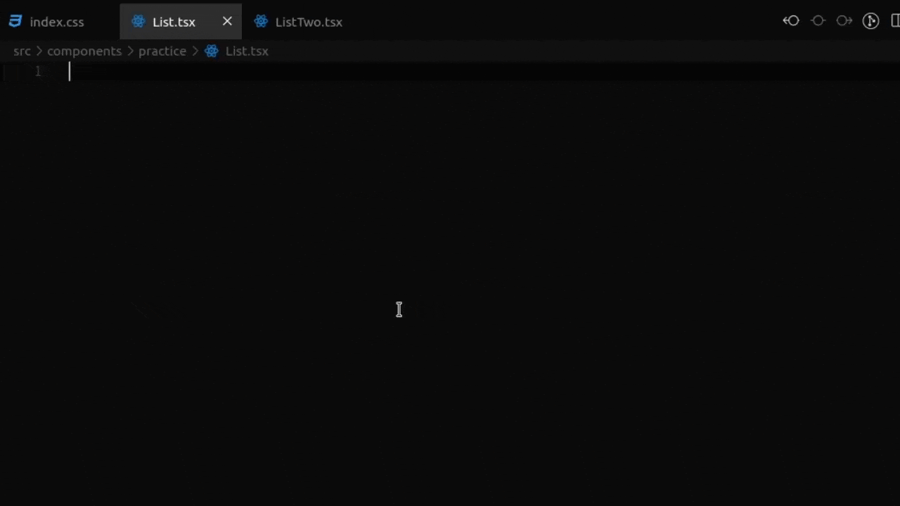

# Lynx-js Snippets ⚡

A powerful collection of snippets to boost your development workflow with Lynx.js



<p align="center">
    <a href="https://marketplace.visualstudio.com/items?itemName=bastndev.lynx-js-snippets"></a>&nbsp;
    <a href="https://marketplace.visualstudio.com/items?itemName=bastndev.lynx-js-snippets"></a>&nbsp;
    <a href="https://marketplace.visualstudio.com/items?itemName=bastndev.lynx-js-snippets"></a>&nbsp;
    <a href="https://github.com/sponsors/bastndev"></a>
</p>

## Features

Quick and intuitive shortcuts to speed up your Lynx.js development experience:

| 🧩 Snippet              | 🆎 Prefix               | ⚡ Quick Shortcut ⚡ |
| ----------------------- | ----------------------- | -------------------- |
| Import Hook             | `l-hook.import`         | `lho`                |
| Import CSS              | `l-css.import`          | `lcss`               |
| Import SCSS             | `l-scss.import`         | `lscs`               |
| Import Component        | `l-component.import`    | `lcomp`/`lcp`        |
| Import Image            | `l-image.import`        | `lii`                |
| -                       | -                       | -                    |
| View                    | `l-view`                | `lv`                 |
| Text                    | `l-text`                | `lt`                 |
| Image                   | `l-image`               | `limg`               |
| -                       | -                       | -                    |
| List                    | `l-list`                | `ll`                 |
| Scroll View             | `l-scroll-view`         | `lll`                |
| -                       | -                       | -                    |
| Export Arrow Func       | `l-export => function`  | `lex`                |
| Export Normal Func      | `l-exxport {} function` | `lexx`               |
| -                       | -                       | -                    |
| Select Component        | `l-select-component`    | `les`                |
| Open Schema             | `l-open-schema`         | `los`                |
| Array Loop              | `l-array`               | `arr`                |
| List Item               | `l-list-item`           | `ltem`               |
| -                       | -                       | -                    |
| 🧪 Main Component       | `l-main`                | `lmain`              |
| 🧪 Array + List Item    | `l-array.list-item`     | `lal`                |
| 🧪 Export Component Alt | `x-export =>`           | `xx`                 |

</br>

## Installation

Launch _Quick Open_

-  Linux `Ctrl+P`
-  macOS `⌘P`
-  Windows `Ctrl+P`

Paste the following command and press `Enter`:

```
ext install bastndev.lynx-js-snippets
```

## Usage

1.  Open a file where you intend to write Lynx.js code (e.g., `.tsx`, `.jsx`).
2.  Start typing one of the **Shortcuts** listed above.
3.  Press `Tab` or `Enter` when the snippet suggestion appears to expand it.

## Contributors

Here is the project link if you want to collaborate: [[>\_]](https://github.com/bastndev/Lynx-keymap).

| [](https://www.bastndev.com) |
| :-------------------------------------------------------------------------------: |
|                 **[Gohit Bastian](https://github.com/bastndev)**                  |

## About Me

- 🐦 [X](https://twitter.com/bastndev) - For questions and discussions.
- 💬 [Discord](https://discord.com/invite/bgzvzP6aZH) - For community interaction.
- ▶️ [Youtube](https://www.youtube.com/@bastndev) - For content about Lynx and programming.

</br>

| Icon                                                                                                                                           | Name                                                                                             | Description                                                                                                                                     |
| ---------------------------------------------------------------------------------------------------------------------------------------------- | ------------------------------------------------------------------------------------------------ | ----------------------------------------------------------------------------------------------------------------------------------------------- |
|   | [Lynx Theme](https://marketplace.visualstudio.com/items?itemName=bastndev.lynx-theme)            | A sleek, customizable VS Code theme with built‑in support for Cursor‑AI, Windsurf & Trae‑AI integrations.                                       |
|  | [LynxJS Pack](https://marketplace.visualstudio.com/items?itemName=bastndev.lynxjs-pack)          | An all‑in‑one toolkit for LynxJS mobile/web development—bundles keymap, snippets & AI tools like Cursor AI, Windsurf, Trae AI, Firebase Studio. |
|                                             | [Lynx Keymap + AI 75%](https://marketplace.visualstudio.com/items?itemName=bastndev.lynx-keymap) | An all‑in‑one toolkit for LynxJS mobile/web development—bundles keymap, snippets & AI tools like Cursor AI, Windsurf, Trae AI, Firebase Studio. |

**Enjoy coding faster with Lynx-js Snippets!If you have a suggestion, [open an issue](https://github.com/bastndev/Lynx-js-Snippets/issues)** and
[MORE](https://marketplace.visualstudio.com/publishers/bastndev) 🚀...
